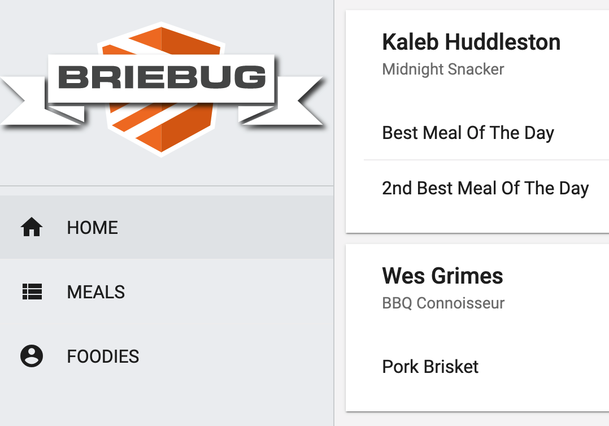

# Foodie/Meal Dashboard

This project was generated using [Nx](https://nx.dev).



## App Description

This is the 5th of 8 Accelerated Angular LevelUp Applications.
It aims to show a more complex feature set/data model for a fully reactive, unit tested, lazy loaded, well architected Angular application.

Specifically, this dashboard app features CRUD functionality on two entities - Foodies...

```json
"foodies": [
    {
      "id": "56789f40-b0fb-4aa6-8e88-376b4edfm8he",
      "nickName": "Nanny",
      "type": "Midnight Snacker",
      "firstName": "Kaleb",
      "lastName": "Huddleston",
      "email": "kaleb@foodie.com",
      "meals": [
        {
          "id": "56789f40-b0fb-4aa6-4e88-376b4edfm8he",
          "title": "Best Meal Of The Day",
          "description": "Bacon, Eggs, Gravy Biscuits",
          "type": "TBD",
          "time": "Breakfast",
          "foodieId": "56789f40-b0fb-4aa6-8e88-376b4edfm8he"
        },
      ]
    }
```

and Meals...

```json
"meals": [
    {
      "id": "4b26bc7d-03dd-47a9-9d4c-a864a04726f2",
      "title": "Pork Brisket",
      "description": "NC Staple",
      "type": "BBQ",
      "time": "Supper",
      "foodieId": "b26f48b2-1ffb-4225-91ec-4f5318870186"
    }
  ]
```

and assign meals to any foodie you like.
The home page shows all foodies with their favorite meals.

- Both feature modules are lazy loaded.

## See It Live

[Visit Foodie Dashboard](https://levelup-angular-05-foodies.surge.sh/)

## Getting Started

Run `npm install`.

## Development server

Run `npm run serve:all` for a dev server and to run the json-server api. Navigate to http://localhost:4200/. The app will automatically reload if you change any of the source files.

## Build

Run `ng build dashboard` to build the project. The build artifacts will be stored in the `dist/` directory. Use the `--prod` flag for a production build.

## Understand your workspace

Run `nx dep-graph` to see a diagram of the dependencies of your projects.
